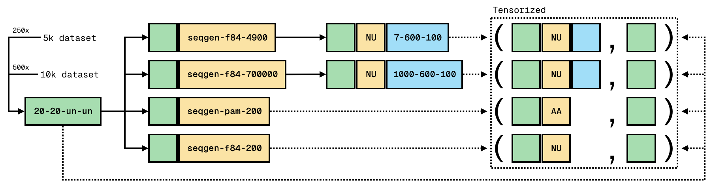

# Datasets



## Trees


#### 10k-20-20-un-un
```bash
# Generate trees
for i in {1..500}; do echo "[$i/500]"; python generate_trees.py -o 10k-20-20-un-un -t 20 -l 20 -s uniform -d uniform; done
```
#### 5k-20-20-un-un
```bash
# Generate trees
for i in {1..250}; do echo "[$i/250]"; python generate_trees.py -o 5k-20-20-un-un -t 20 -l 20 -s uniform -d uniform; done
```
#### 500-20-20-un-un
```bash
# Generate trees
for i in {1..25}; do echo "[$i/25]"; python generate_trees.py -o 500-20-20-un-un -t 20 -l 20 -s uniform -d uniform; done
```


## Alignments


### Amino Acids

#### 10k-20-20-un-un-seqgen-pam-200
```bash
# Generate alignments (amino acids of 200 sequence length)
python generate_alignments.py -t 10k-20-20-un-un -o 10k-20-20-un-un-seqgen-pam-200 -g ./sequence_generators/seq-gen -m PAM -l 200
```
#### 5k-20-20-un-un-seqgen-pam-200
```bash
# Generate alignments (amino acids of 200 sequence length)
python generate_alignments.py -t 5k-20-20-un-un -o 5k-20-20-un-un-seqgen-pam-200 -g ./sequence_generators/seq-gen -m PAM -l 200
```
#### 500-20-20-un-un-seqgen-pam-200
```bash
# Generate alignments (amino acids of 200 sequence length)
python generate_alignments.py -t 500-20-20-un-un -o 500-20-20-un-un-seqgen-pam-200 -g ./sequence_generators/seq-gen -m PAM -l 200
```


### Nucleotides

#### 10k-20-20-un-un-seqgen-f84-700000
```bash
# Generate alignments (nucleotides of 700000 (700x1000) sequence length)
python generate_alignments.py -t 10k-20-20-un-un -o 10k-20-20-un-un-seqgen-f84-700000 -g ./sequence_generators/seq-gen -m F84 -l 700000
```
#### 5k-20-20-un-un-seqgen-f84-700000
```bash
# Generate alignments (nucleotides of 700000 (700x1000) sequence length)
python generate_alignments.py -t 5k-20-20-un-un -o 5k-20-20-un-un-seqgen-f84-700000 -g ./sequence_generators/seq-gen -m F84 -l 700000
```
#### 10k-20-20-un-un-seqgen-f84-200
```bash
# Generate alignments (nucleotides of 200 sequence length)
python generate_alignments.py -t 10k-20-20-un-un -o 10k-20-20-un-un-seqgen-f84-200 -g ./sequence_generators/seq-gen -m F84 -l 200
```
#### 5k-20-20-un-un-seqgen-f84-200
```bash
# Generate alignments (nucleotides of 200 sequence length)
python generate_alignments.py -t 5k-20-20-un-un -o 5k-20-20-un-un-seqgen-f84-200 -g ./sequence_generators/seq-gen -m F84 -l 200
```
#### 10k-20-20-un-un-seqgen-f84-4900
```bash
# Generate alignments (nucleotides of 4900 (700x7) sequence length)
python generate_alignments.py -t 10k-20-20-un-un -o 10k-20-20-un-un-seqgen-f84-4900 -g ./sequence_generators/seq-gen -m F84 -l 4900
```
#### 5k-20-20-un-un-seqgen-f84-4900
```bash
# Generate alignments (nucleotides of 4900 (700x7) sequence length)
python generate_alignments.py -t 5k-20-20-un-un -o 5k-20-20-un-un-seqgen-f84-4900 -g ./sequence_generators/seq-gen -m F84 -l 4900
```
#### 500-20-20-un-un-seqgen-f84-700000
```bash
# Generate alignments (nucleotides of 700000 (700x1000) sequence length)
python generate_alignments.py -t 500-20-20-un-un -o 500-20-20-un-un-seqgen-f84-700000 -g ./sequence_generators/seq-gen -m F84 -l 700000
```
#### 500-20-20-un-un-seqgen-f84-200
```bash
# Generate alignments (nucleotides of 200 sequence length)
python generate_alignments.py -t 500-20-20-un-un -o 500-20-20-un-un-seqgen-f84-200 -g ./sequence_generators/seq-gen -m F84 -l 200
```
#### 500-20-20-un-un-seqgen-f84-4900
```bash
# Generate alignments (nucleotides of 4900 (700x7) sequence length)
python generate_alignments.py -t 500-20-20-un-un -o 500-20-20-un-un-seqgen-f84-4900 -g ./sequence_generators/seq-gen -m F84 -l 4900
```


## Typings


#### 10k-20-20-un-un-seqgen-f84-700000-1000-600-100
```bash
# Generate typings (1000 blocks of 600 sequence length)
python generate_typings.py -a 10k-20-20-un-un-seqgen-f84-700000 -o 10k-20-20-un-un-seqgen-f84-700000-1000-600-100 -b 1000 -e 600 -i 100
```
#### 5k-20-20-un-un-seqgen-f84-700000-1000-600-100
```bash
# Generate typings (1000 blocks of 600 sequence length)
python generate_typings.py -a 5k-20-20-un-un-seqgen-f84-700000 -o 5k-20-20-un-un-seqgen-f84-700000-1000-600-100 -b 1000 -e 600 -i 100
```
#### 10k-20-20-un-un-seqgen-f84-4900-7-600-100
```bash
# Generate typings (7 blocks of 600 sequence length)
python generate_typings.py -a 10k-20-20-un-un-seqgen-f84-4900 -o 10k-20-20-un-un-seqgen-f84-4900-7-600-100 -b 7 -e 600 -i 100
```
#### 5k-20-20-un-un-seqgen-f84-4900-7-600-100
```bash
# Generate typings (7 blocks of 600 sequence length)
python generate_typings.py -a 5k-20-20-un-un-seqgen-f84-4900 -o 5k-20-20-un-un-seqgen-f84-4900-7-600-100 -b 7 -e 600 -i 100
```
#### 500-20-20-un-un-seqgen-f84-700000-1000-600-100
```bash
# Generate typings (1000 blocks of 600 sequence length)
python generate_typings.py -a 500-20-20-un-un-seqgen-f84-700000 -o 500-20-20-un-un-seqgen-f84-700000-1000-600-100 -b 1000 -e 600 -i 100
```
#### 500-20-20-un-un-seqgen-f84-4900-7-600-100
```bash
# Generate typings (7 blocks of 600 sequence length)
python generate_typings.py -a 500-20-20-un-un-seqgen-f84-4900 -o 500-20-20-un-un-seqgen-f84-4900-7-600-100 -b 7 -e 600 -i 100
```


## Typing data


#### 10k-20-20-un-un-seqgen-f84-700000-1000-600-100
```bash
# Generate typing data tensor pairs (X: typing, y: tree)
python generate_typing_data.py -t 10k-20-20-un-un -y 10k-20-20-un-un-seqgen-f84-700000-1000-600-100 -o 10k-20-20-un-un-seqgen-f84-700000-1000-600-100
```
#### 5k-20-20-un-un-seqgen-f84-700000-1000-600-100
```bash
# Generate typing data tensor pairs (X: typing, y: tree)
python generate_typing_data.py -t 5k-20-20-un-un -y 5k-20-20-un-un-seqgen-f84-700000-1000-600-100 -o 5k-20-20-un-un-seqgen-f84-700000-1000-600-100
```
#### 10k-20-20-un-un-seqgen-f84-4900-7-600-100
```bash
# Generate typing data tensor pairs (X: typing, y: tree)
python generate_typing_data.py -t 10k-20-20-un-un -y 10k-20-20-un-un-seqgen-f84-4900-7-600-100 -o 10k-20-20-un-un-seqgen-f84-4900-7-600-100
```
#### 5k-20-20-un-un-seqgen-f84-4900-7-600-100
```bash
# Generate typing data tensor pairs (X: typing, y: tree)
python generate_typing_data.py -t 5k-20-20-un-un -y 5k-20-20-un-un-seqgen-f84-4900-7-600-100 -o 5k-20-20-un-un-seqgen-f84-4900-7-600-100
```


## Sequence data


#### 10k-20-20-un-un-seqgen-pam-200-aa
```bash
# Generate sequence data tensor pairs (X: alignment/sequence, y: tree)
python generate_sequence_data.py -t 10k-20-20-un-un -a 10k-20-20-un-un-seqgen-pam-200 -o 10k-20-20-un-un-seqgen-pam-200-aa -v amino_acids
```
#### 5k-20-20-un-un-seqgen-pam-200-aa
```bash
# Generate sequence data tensor pairs (X: alignment/sequence, y: tree)
python generate_sequence_data.py -t 5k-20-20-un-un -a 5k-20-20-un-un-seqgen-pam-200 -o 5k-20-20-un-un-seqgen-pam-200-aa -v amino_acids
```
#### 10k-20-20-un-un-seqgen-f84-200-nu
```bash
# Generate sequence data tensor pairs (X: alignment/sequence, y: tree)
python generate_sequence_data.py -t 10k-20-20-un-un -a 10k-20-20-un-un-seqgen-f84-200 -o 10k-20-20-un-un-seqgen-f84-200-nu -v nucleotides
```
#### 5k-20-20-un-un-seqgen-f84-200-nu
```bash
# Generate sequence data tensor pairs (X: alignment/sequence, y: tree)
python generate_sequence_data.py -t 5k-20-20-un-un -a 5k-20-20-un-un-seqgen-f84-200 -o 5k-20-20-un-un-seqgen-f84-200-nu -v nucleotides
```


# Train + Validation
```bash
python train.py -c train/configs/config-10k-typ-1000-600.yaml 50 -d cuda:0 -w online
python train.py -c train/configs/config-5k-typ-1000-600.yaml 50 -d cuda:1 -w online

python train.py -c train/configs/config-10k-seq-aa.yaml 50 -d cuda:2 -w online
python train.py -c train/configs/config-5k-seq-aa.yaml 50 -d cuda:2 -w online

python train.py -c train/configs/config-10k-seq-nu.yaml 50 -d cuda:3 -w online
python train.py -c train/configs/config-5k-seq-nu.yaml 50 -d cuda:3 -w online

python train.py -c train/configs/config-10k-typ-7-600.yaml 50 -d mps -w online
python train.py -c train/configs/config-5k-typ-7-600.yaml 50 -d mps -w online
```


# Test
```bash
python typing_true_trees.py -y 500-20-20-un-un-seqgen-f84-700000-1000-600-100 -o 500-20-20-un-un-seqgen-f84-700000-1000-600-100
python typing_true_trees.py -y 500-20-20-un-un-seqgen-f84-4900-7-600-100 -o 500-20-20-un-un-seqgen-f84-4900-7-600-100
python sequence_true_trees.py -a 500-20-20-un-un-seqgen-f84-200 -o 500-20-20-un-un-seqgen-f84-200
python sequence_true_trees.py -a 500-20-20-un-un-seqgen-pam-200 -o 500-20-20-un-un-seqgen-pam-200

python sequence_predicted_trees.py -a 500-20-20-un-un-seqgen-pam-200 -o pkuyiofs-khmvtpeh -m train/checkpoints/pkuyiofs/khmvtpeh.best_checkpoint.pt -d cuda:0 -s
python evaluate.py -t 500-20-20-un-un-seqgen-pam-200 -p pkuyiofs-khmvtpeh

python sequence_predicted_trees.py -a 500-20-20-un-un-seqgen-f84-200 -o f6v088s5-7rbm50jz -m train/checkpoints/f6v088s5/7rbm50jz.best_checkpoint.pt -d cuda:1 -s
python evaluate.py -t 500-20-20-un-un-seqgen-f84-200 -p f6v088s5-7rbm50jz

python typing_predicted_trees.py -y 500-20-20-un-un-seqgen-f84-700000-1000-600-100 -o 2lpmtamt-wirkf2ck -m train/checkpoints/2lpmtamt/wirkf2ck.best_checkpoint.pt -d cuda:1 -s
python evaluate.py -t 500-20-20-un-un-seqgen-f84-700000-1000-600-100 -p 2lpmtamt-wirkf2ck
```


# Setup
```bash
conda create -n dl4phylo python=3.11

# https://pytorch.org
conda install pytorch torchvision torchaudio cpuonly -c pytorch                         # linux/windows (cpu)
conda install pytorch torchvision torchaudio pytorch-cuda=12.1 -c pytorch -c nvidia     # linux/windows (cuda)
conda install pytorch::pytorch torchvision torchaudio -c pytorch                        # macos

pip install biopython dendropy ete3 scikit-bio scipy tqdm wandb


# Download Seq-Gen (https://github.com/rambaut/Seq-Gen/releases/tag/1.3.4)
tar -xvzf Seq-Gen-1.3.4.tar.gz
cd Seq-Gen-1.3.4/source
make
```
