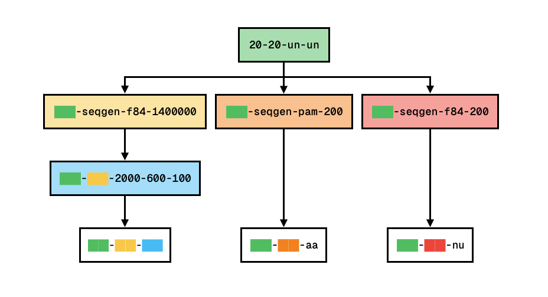

## Datasets

### Demo

#### original
```bash
# Generate trees
for i in {1..500}; do python generate_trees.py -o original -t 20 -l 20 -s uniform -d uniform; done

# Generate alignments (nucleotides of 4900 sequence length)
python generate_alignments.py -t original -o original -g ./sequence_generators/seq-gen -m F84 -l 4900

# Generate typings (7 blocks of 600 sequence length)
python generate_typings.py -a original -o original -b 7 -e 600 -i 100

# Generate typing data tensors (X: typing, y: tree)
python generate_typing_data.py -t original -y original -o original
```

#### original-test
```bash
# Generate trees
python generate_trees.py -o original-test -t 20 -l 20 -s uniform -d uniform

# Generate alignments (nucleotides of 4900 sequence length)
python generate_alignments.py -t original-test -o original-test -g ./sequence_generators/seq-gen -m F84 -l 4900

# Generate typings (7 blocks of 600 sequence length)
python generate_typings.py -a original-test -o original-test -b 7 -e 600 -i 100

# Generate typing data tensors (X: typing, y: tree)
# No need since we do not use it for training or validation, only for testing.
```

#### original-sequence + original-sequence-aa
```bash
# Generate trees
# No need since we can use the original trees

# Generate alignments (amino acids of 200 sequence length)
python generate_alignments.py -t original -o original-sequence -g ./sequence_generators/seq-gen -m PAM -l 200

# Generate sequence data tensors (X: alignment/sequence, y: tree)
python generate_sequence_data.py -t original -a original-sequence -o original-sequence-aa -v amino_acids
```

#### original-test-sequence
```bash
# Generate trees
# No need since we can use the original trees

# Generate alignments (amino acids of 200 sequence length)
python generate_alignments.py -t original-test -o original-test-sequence -g ./sequence_generators/seq-gen -m PAM -l 200

# Generate sequence data tensors (X: alignment/sequence, y: tree)
# No need since we do not use it for training or validation, only for testing.
```

### Main

#### 20-20-un-un (100k trees)
```bash
# Generate trees
for i in {1..5000}; do python generate_trees.py -o 20-20-un-un -t 20 -l 20 -s uniform -d uniform; done
```

#### 20-20-un-un-seqgen-f84-1400000 (100k alignments)
```bash
# Generate alignments (nucleotides of 1400000 (700x2000) sequence length)
python generate_alignments.py -t 20-20-un-un -o 20-20-un-un-seqgen-f84-1400000 -g ./sequence_generators/seq-gen -m F84 -l 1400000
```

#### 20-20-un-un-seqgen-pam-200 (100k alignments)
```bash
# Generate alignments (amino acids of 200 sequence length)
python generate_alignments.py -t 20-20-un-un -o 20-20-un-un-seqgen-pam-200 -g ./sequence_generators/seq-gen -m PAM -l 200
```

#### 20-20-un-un-seqgen-f84-200 (100k alignments)
```bash
# Generate alignments (nucleotides of 200 sequence length)
python generate_alignments.py -t 20-20-un-un -o 20-20-un-un-seqgen-f84-200 -g ./sequence_generators/seq-gen -m F84 -l 200
```

#### 20-20-un-un-seqgen-f84-1400000-2000-600-100 (100k typings)
```bash
# Generate typings (2000 blocks of 600 sequence length)
python generate_typings.py -a 20-20-un-un-seqgen-f84-1400000 -o 20-20-un-un-seqgen-f84-1400000-2000-600-100 -b 2000 -e 600 -i 100
```

#### 20-20-un-un-seqgen-f84-1400000-2000-600-100 (100k tensor pairs)
```bash
# Generate typing data tensors (X: typing, y: tree)
python generate_typing_data.py -t 20-20-un-un -y 20-20-un-un-seqgen-f84-1400000-2000-600-100 -o 20-20-un-un-seqgen-f84-1400000-2000-600-100
```

#### 20-20-un-un-seqgen-pam-200-aa (100k tensor pairs)
```bash
# Generate sequence data tensors (X: alignment/sequence, y: tree)
python generate_sequence_data.py -t 20-20-un-un -a 20-20-un-un-seqgen-pam-200 -o 20-20-un-un-seqgen-pam-200-aa -v amino_acids
```

#### 20-20-un-un-seqgen-f84-200-nu (100k tensor pairs)
```bash
# Generate sequence data tensors (X: alignment/sequence, y: tree)
python generate_sequence_data.py -t 20-20-un-un -a 20-20-un-un-seqgen-f84-200 -o 20-20-un-un-seqgen-f84-200-nu -v nucleotides
```

